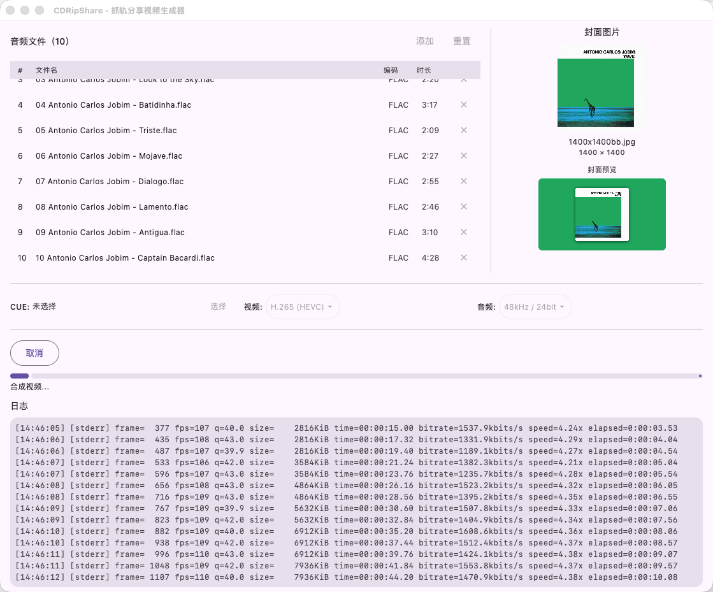

# CDRipShare Compose（历史版本）

> 此目录保存已经停止维护的 Compose Desktop 实现。当前主版本位于仓库根目录，使用 Rust 和 egui 开发。

本工具旨在方便抓轨爱好者分享自己购买 CD 的抓轨文件。

目前软件仍不成熟，功能尚不完善。

## 功能

1. 左上角：选择音频并进行排序；
2. 右上角：选择专辑封面并自动生成1080p视频图片；
3. 中间：选择CUE（切轨文件）、视频编码、音频编码；
4. 下方：显示编码进程、输出文件等。

音频编码告示：Bilibili 视频的无损编码仅当高于 48khz 采样率且高于 24bit 采样位数才可启用，且有高码率降低为低码率的可能性。

## AI 编程告示

本程序从2026年6月26日开始编程到2026年6月28日编程结束为止，全部为氛围编程产品，本人并没有修改一行代码。

本软件旨在于 Mimo-Pro 免费额度到期前，尽量用完所有的额度。

对于我 AI 编程相关的历史，可以看 docs 文件夹中的文件。

## 进一步优化的可能性

- [ ] 封面生成器优化，基于 Kotlin-Skia 技术搞一个
- [ ] ProjectM 或其他可视化集成

自动上传机制方面，可能以我目前能力来看，难以实现。

## 授权

基于用到了 GPL 版本的 FFmpeg ，本软件使用 GPLv2+。这是因为 h265 编码器 libx265 是 GPLv2+。

本软件使用 FFmpeg 的方式是子进程执行。

## 已有成功案例

- https://www.bilibili.com/video/BV1z57n6NETg/

  （第一次运行，发现 B 站接受不了 44.1/16 的无损）

- https://www.bilibili.com/video/BV1n37n6MEzb/ 

  （第二次运行，48/24 能够让 B 站接受了）

- https://www.bilibili.com/video/BV1x17p6QEGE/ 

  （第三次运行，UI 修改）

- https://www.bilibili.com/video/BV16o7p65E9d/ 

  （第四次运行，由 AI 编写的封面生成器，使用图片所有像素算颜色最突出的部分）
